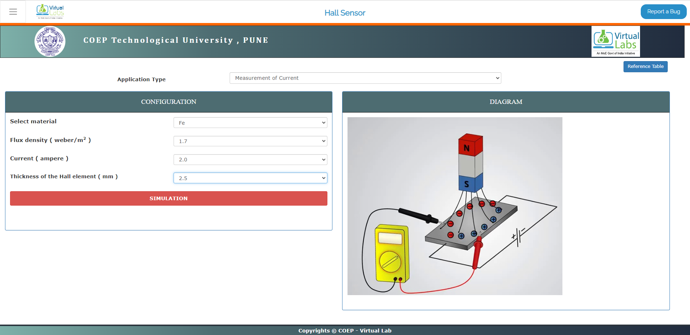

### Procedure

#### Prerequisite : 
- Answer all the questions and click on "Submit Test" button.
- Click on "Next" button.

#### Configuration and simulation

##### Click on the "Reference table" button to get References of hall coefficients for different material.

##### Application type : Measurement of Current

- Step 1 : Configure hall effect sensor by selecting material, flux density, current, and thickness as shown below. 

- Step 2 : Click on next simulation button.

- Step 3 : Click on green circle appeared on the screen in simulation block to view hall sensor simulator.

- Step 4 : Calculate hall sensor output and enter in the textbox and check the answer by clicking on "Submit" button.

- Step 5 : Repeat the above steps for all the available current readings.

- Step 6 : Click on "Select another application" button.

##### Application type : Measurement of Thickness

- Step 7 : Select another application type for thickness.

- Step 8 : Repeat Step 1 to Step 5 for different thickness readings.

- Step 9 : Click on "Show Result" button to get the result.