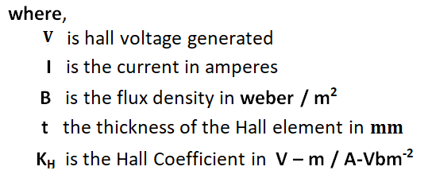

### HALL EFFECT TRANSDUCERS

#### Hall element

A number of transducers can be designed using a Hall element This Hall effect is possesed by certain metals and certain semiconductor elements. When a Hall element is subjected to a magnetic field in one direction, an electric current in another direction which is perpendicular to the direction of the magnetic flux, then an electric potential is generated in a third direction which is mutually perpendicular to the other two directions. The magnitude of the voltage generated depends on the strength of the magnetic field, the strength of the current and the property of the conductor.

The nominal values of Hall coefficients for differentmaterials are given in Table
Hall coefficients

#### Hall effect transducer for Flux measurement
A semiconductor Hall element can be used to transduce magnetic flux into a voltage. The flat surface of semiconductor plate is kept perpendicular to the magnetic field to be transduced. A known fixed current is passed through side of the plate as shown in fig. 1. Then the voltage generated across the mutually perpendicular surface is proportional to the flux density.
This element gives a continuous output proportional to the magnetic flux variation.

The disadvantages are :
(i) this element is sensitive to temperature variations.
(ii) The Hall coefficient changes from element to element needing individual calibration.

#### Hall displacement transducer
Hall element can be used for the measurement of displacement of a structural element. Consider the diagram shown in fig. 2. A structural member whose displacement is to be measured is fixed with a permanent magnet.

In the gap provided in the structural member a Hall element is inserted. The field strength produced by the permanent magnet in the gap varies when the structural member is subjected to a movement or displacement. It might be noted the portion of the Hall element is fixed and it does not move. A fixed current is passed through the Hall element.
The output voltage generated by the Hall element is proportional to the magnetic filed lines passing through the Hall element which depends on the relative position of the Hall element and the structural element. The device can be used for displacements raging from 0.1mm to 10mm.

#### Hall transducer for current measurement
The diagram shown in fig.2 can also be used as an ammeter for measurement of current. Here the portion of the structural member is kept fixed and current I is varied. The voltage generated will be proportional to the current. Once this device is calibrated for different values of current, any unknown current can be measured by passing it through this element.

#### Hall transducer for thickness measurement
Hall sensors measure the Hall voltage generated when a magnetic field is applied perpendicular to the direction of current flow. This property can be used to infer thickness by measuring the change in Hall voltage in response to variations in material distance or thickness.
- Hall sensors can measure thickness without direct contact with the material, reducing the risk of damaging sensitive surfaces.
- They can detect small changes in thickness, making them suitable for applications requiring high precision.
- Hall sensors are generally durable and can operate in various environmental conditions.
- The setup for using Hall sensors in thickness measurement is relatively straightforward compared to other methods like ultrasonic thickness gauges.